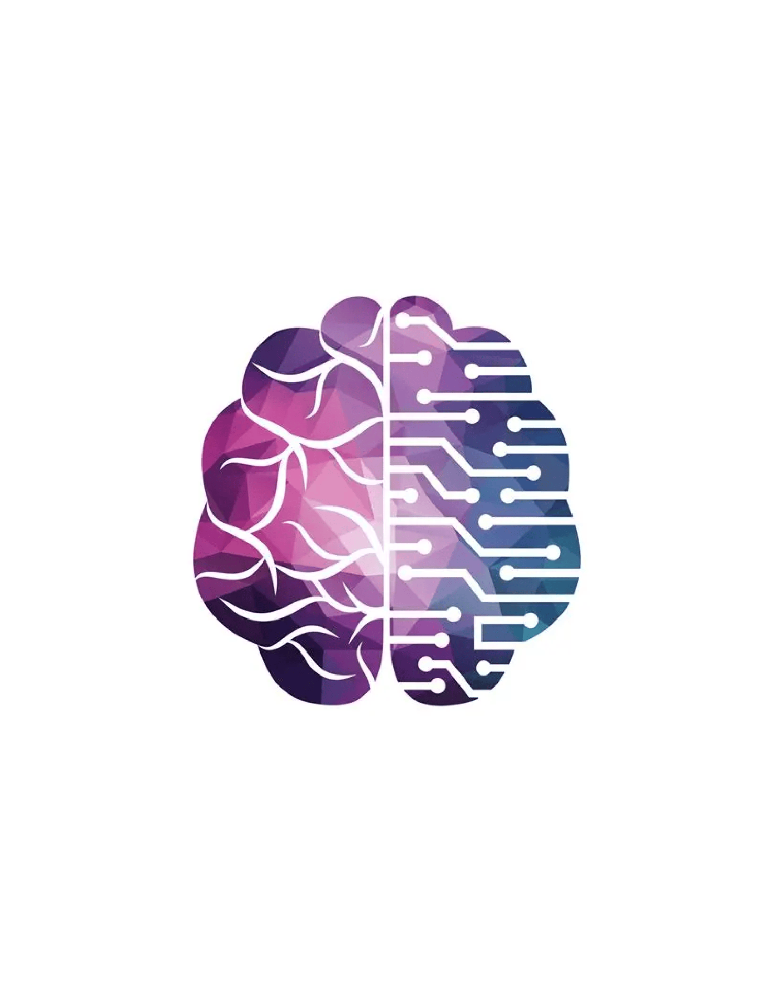

# CognitiveModeling
Cognitive Modeling Combined Github  
##Why Cognitive Modeling Matters  
Cognitive modeling is importaat in psychology and cognitive science because it models theories to be explicit and precise, allowing us to compare the behavioral and neural data. 
It also explains the different things that people do and figure out how and why the mental process produces that end behavior. 
It also connects psychology to neuroscience, artifical intelligence and also computer science.

